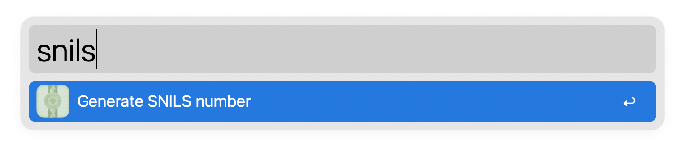

# Alfred SNILS generator

Alfred workflow, which generates the SNILS. Makes life a lot easier for those working on Russian electronic document management products

## Installation

Download the latest version from the [releases page](https://github.com/mishamyrt/alfred-snils-generator/releases) and double-click on the downloaded file. 

## Usage

Call up the Alfred panel and start typing `snils`. Once you have pressed Enter, the generated SNILS will be copied to the clipboard.

    

